# Heart Disease Risk Prediction Using Decision Trees and XGBoost

A machine learning portfolio project that predicts heart disease risk using patient medical data.

This project covers important machine learning concepts such as data cleaning, exploratory data analysis, classification, Logistic Regression, Decision Trees, entropy, XGBoost, model evaluation, prediction pipeline, and Streamlit app development.

---

## Project Overview

The goal of this project is to predict whether a patient may have heart disease based on medical features such as age, chest pain type, resting blood pressure, cholesterol, maximum heart rate, exercise-induced angina, and other clinical attributes.

This is a **binary classification** project.

| Target Value | Meaning |
|---|---|
| 0 | No Heart Disease |
| 1 | Heart Disease Risk |

The original dataset had target values from 0 to 4. For this project, values 1, 2, 3, and 4 were converted into 1, meaning heart disease is present.

---

## Dataset Information

The dataset used in this project is the **Cleveland Heart Disease Dataset** from the UCI Machine Learning Repository.

### Dataset Summary

| Item | Description |
|---|---|
| Dataset | Cleveland Heart Disease Dataset |
| Source | UCI Machine Learning Repository |
| Original Records | 303 |
| Cleaned Records | 297 |
| Input Features | 13 |
| Target Column | target |
| Problem Type | Binary Classification |

### Features Used

| Feature | Meaning |
|---|---|
| age | Patient age |
| sex | Patient sex |
| cp | Chest pain type |
| trestbps | Resting blood pressure |
| chol | Cholesterol level |
| fbs | Fasting blood sugar above 120 mg/dl |
| restecg | Resting ECG result |
| thalach | Maximum heart rate achieved |
| exang | Exercise-induced angina |
| oldpeak | ST depression value |
| slope | Slope of peak exercise ST segment |
| ca | Number of major vessels colored by fluoroscopy |
| thal | Thalassemia test category |
| target | Heart disease result |

---

## Data Cleaning

The raw dataset contained missing values represented by `?`. These values were converted into proper missing values while loading the dataset:

```python
df = pd.read_csv(
    data_path,
    names=column_names,
    na_values="?"
)
```

Here, `na_values="?"` tells Pandas to treat `?` as a missing value/NaN.

Main cleaning steps:

- Added proper column names
- Converted `?` into missing values
- Removed missing values
- Removed duplicate rows
- Converted target into binary classification
- Converted integer-like columns into integer data type
- Saved cleaned dataset as `heart_cleaned.csv`

---

## Exploratory Data Analysis

Exploratory Data Analysis was performed to understand the dataset before model training.

### Target Distribution

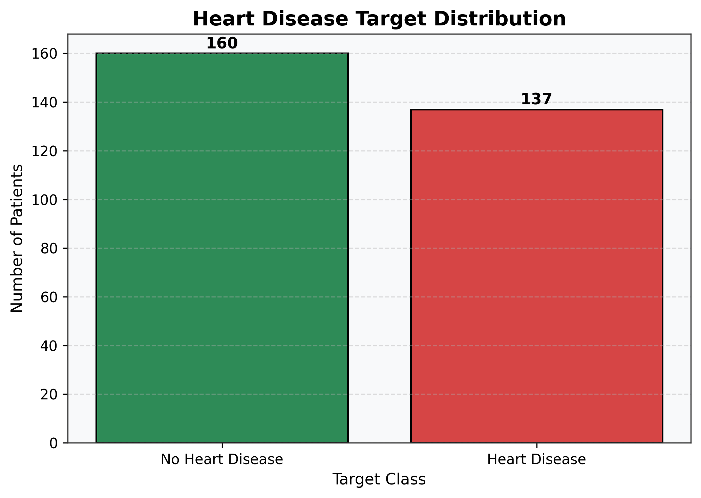

The dataset is fairly balanced, with 160 patients having no heart disease and 137 patients having heart disease.

### Age Distribution

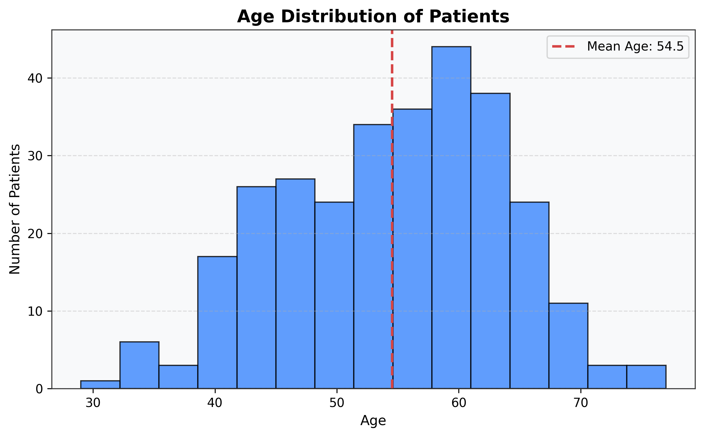

Most patients are middle-aged or older, and the average age is around 54.5 years.

### Heart Disease by Sex

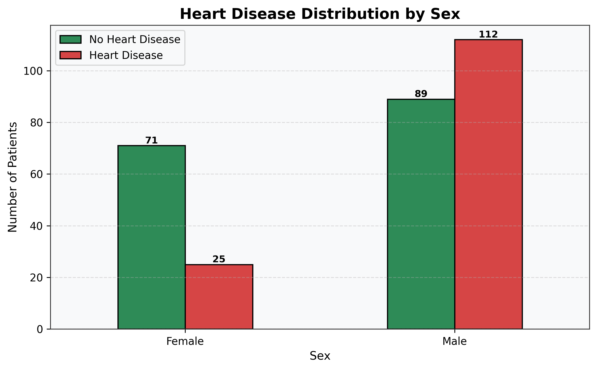

The chart shows heart disease distribution by sex. In this dataset, male patients have a higher number of heart disease cases.

### Chest Pain Type vs Heart Disease

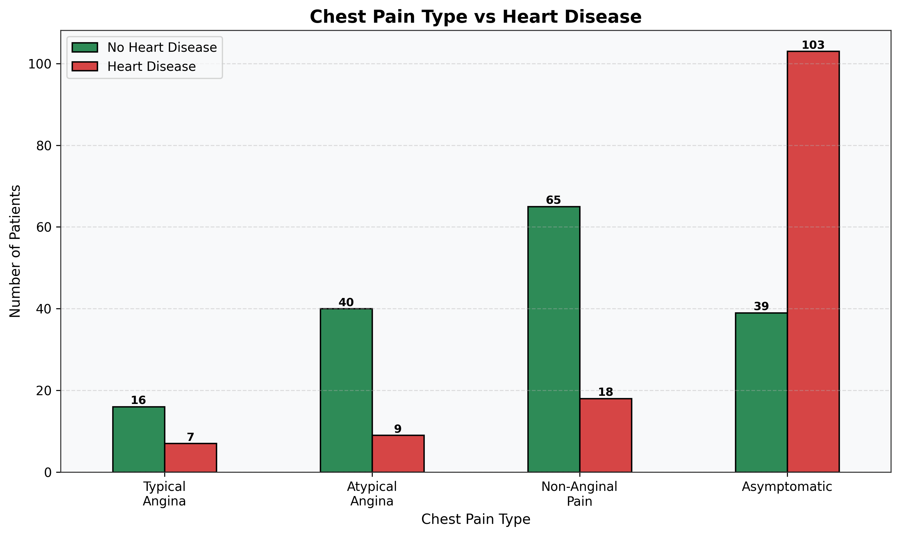

Chest pain type is an important feature. Asymptomatic patients show a high number of heart disease cases.

### Cholesterol Distribution

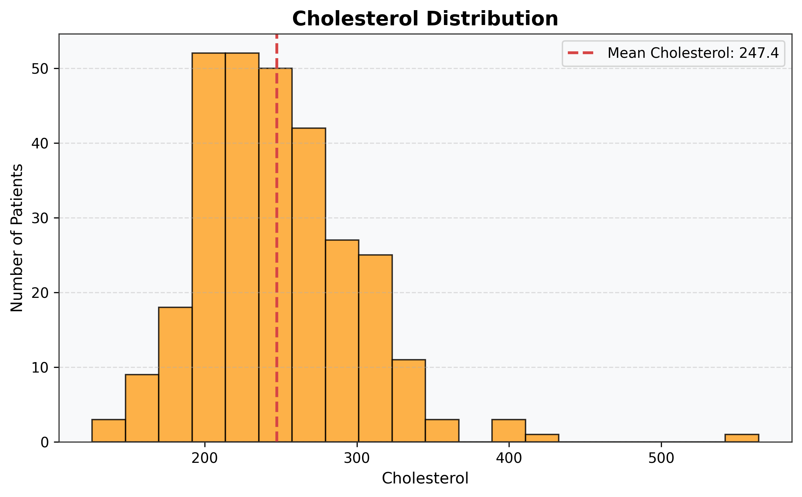

This chart shows the cholesterol distribution of patients in the dataset.

### Cholesterol by Heart Disease Status

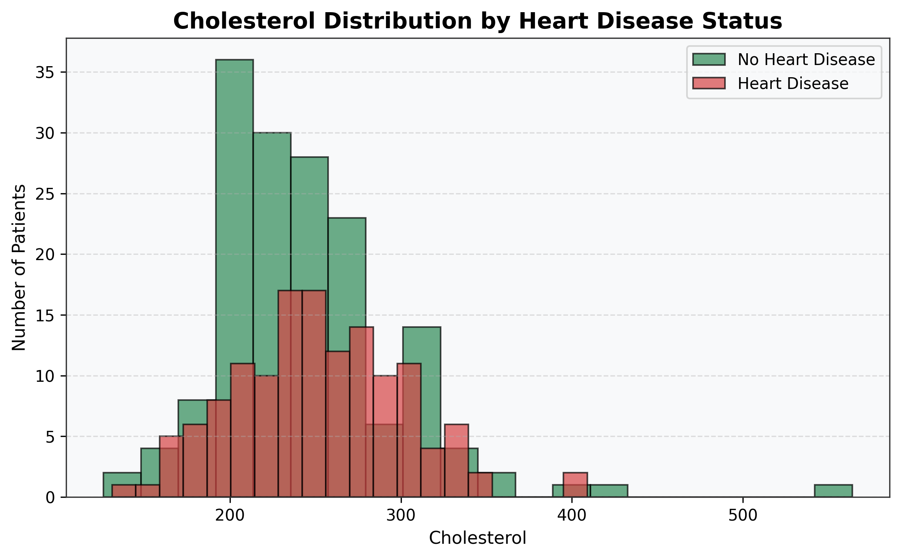

This chart compares cholesterol values between patients with and without heart disease.

### Age vs Maximum Heart Rate

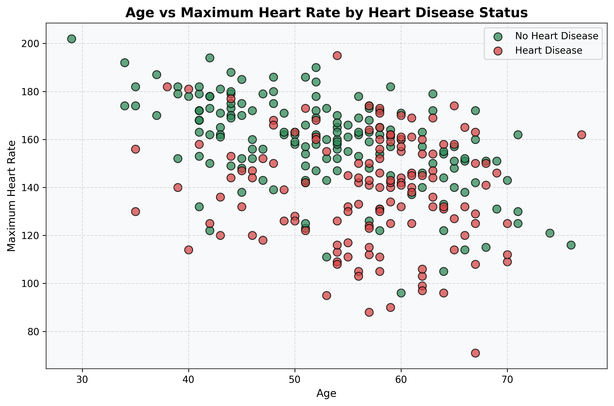

This chart compares age and maximum heart rate by heart disease status.

### Correlation Heatmap

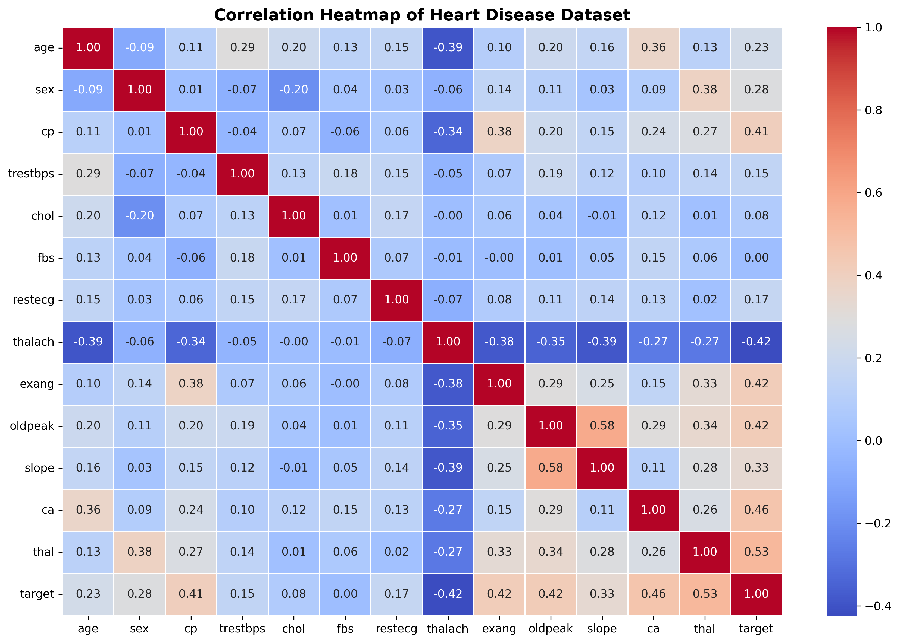

The correlation heatmap helps identify relationships between features and the target variable.

### Feature Correlation with Target

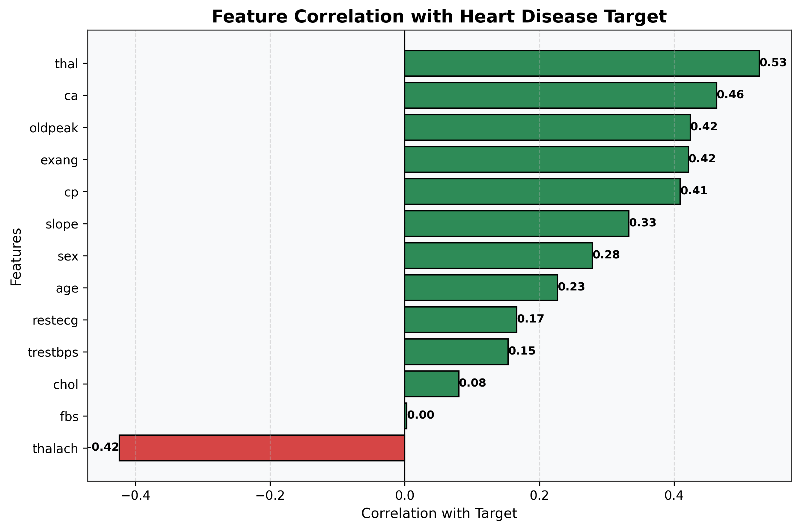

This chart shows which features have positive or negative correlation with the heart disease target.

---

## Machine Learning Models Used

Three machine learning models were trained and compared:

1. Logistic Regression
2. Decision Tree using Entropy
3. XGBoost Classifier

---

## Model Evaluation Metrics

The models were evaluated using the following metrics:

| Metric | Meaning |
|---|---|
| Accuracy | Overall percentage of correct predictions |
| Precision | Out of predicted heart disease cases, how many were actually correct |
| Recall | Out of actual heart disease cases, how many the model correctly found |
| F1-score | Balance between precision and recall |

For this project, recall is especially important because false negatives mean the model missed patients who actually had heart disease.

---

## Model Comparison

| Model | Accuracy | Precision | Recall | F1-score |
|---|---:|---:|---:|---:|
| Logistic Regression | 0.8333 | 0.8462 | 0.7857 | 0.8148 |
| Decision Tree | 0.7667 | 0.8500 | 0.6071 | 0.7083 |
| XGBoost | 0.8500 | 0.8800 | 0.7857 | 0.8302 |

---

## Final XGBoost Result

XGBoost was selected as the final model because it achieved the best overall performance.

| Metric | XGBoost Result |
|---|---:|
| Accuracy | 85.00% |
| Precision | 88.00% |
| Recall | 78.57% |
| F1-score | 83.02% |

### XGBoost Confusion Matrix

|  | Predicted No Heart Disease | Predicted Heart Disease |
|---|---:|---:|
| Actual No Heart Disease | 29 | 3 |
| Actual Heart Disease | 6 | 22 |

### Explanation

The XGBoost model correctly predicted 29 patients with no heart disease and 22 patients with heart disease. It missed 6 actual heart disease cases.

Since this is a medical risk prediction project, recall is important because false negatives can be risky.

---

## Feature Importance

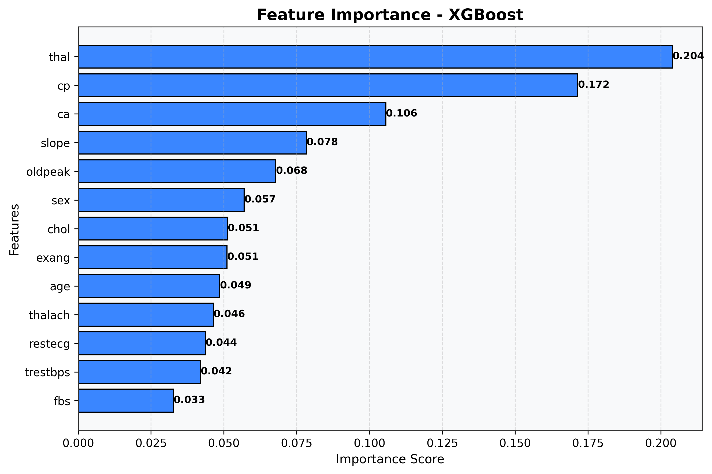

The most important features in the XGBoost model were:

- thal
- cp
- ca
- slope
- oldpeak

These features contributed most to the model’s predictions.

---

## Streamlit Web App

A Streamlit web app was created to make the model interactive.

The app allows users to enter patient information and generate a heart disease risk prediction.

### App Features

- Sidebar patient input form
- Prediction button
- Risk probability
- Low, moderate, or high risk label
- Feature meaning guide
- Model performance summary
- Medical disclaimer
- Footer with portfolio/contact links

---

## Project Structure

```text
heart-disease-risk-prediction/
│
├── app/
│   ├── app.py
│   ├── header.py
│   ├── footer.py
│   └── prediction_logic.py
│
├── assets/
│   └── usama_profile.png
│
├── data/
│   ├── processed.cleveland.data
│   ├── heart.csv
│   └── heart_cleaned.csv
│
├── models/
│   ├── xgboost_heart_disease_model.pkl
│   └── feature_names.pkl
│
├── notebooks/
│   └── heart_disease_prediction.ipynb
│
├── reports/
│   └── figures/
│
├── private_notes/
│
├── README.md
├── requirements.txt
└── report.md
```

Note: The `models/`, `.venv/`, and `private_notes/` folders are kept local and are not pushed publicly.

---

## How to Run the Project

### 1. Clone the Repository

```bash
git clone https://github.com/Usama2001/Heart-Disease-Risk-Prediction-Using-Decision-Trees-and-XGBoost.git
```

```bash
cd Heart-Disease-Risk-Prediction-Using-Decision-Trees-and-XGBoost
```

### 2. Create Virtual Environment

```bash
python -m venv .venv
```

Activate virtual environment on Windows:

```bash
.venv\Scripts\activate
```

### 3. Install Requirements

```bash
pip install -r requirements.txt
```

### 4. Run the Notebook

Open and run:

```text
notebooks/heart_disease_prediction.ipynb
```

Run the notebook up to Step 11 to generate the saved model files.

### 5. Run Streamlit App

```bash
python -m streamlit run app/app.py
```

---

## Important Note About Model File

The trained model files are not pushed publicly because they are ignored in `.gitignore`.

To run the Streamlit app locally, first run the notebook up to Step 11 so the following files are created:

```text
models/xgboost_heart_disease_model.pkl
models/feature_names.pkl
```

---

## Medical Disclaimer

This project is created for educational and portfolio purposes only.

It should not be used as a real medical diagnosis tool.

Any real medical decision should always be made by qualified healthcare professionals.

---

## Final App Threshold

The Streamlit app uses a tuned prediction threshold of **0.30** instead of the default 0.50.

This threshold was selected because it improved recall from **78.57%** to **92.86%** and reduced false negatives from **6** to **2**.

This is useful for a medical-risk screening project because missing actual heart disease cases is more risky than giving extra warning cases.

---

## ROC-AUC Curve

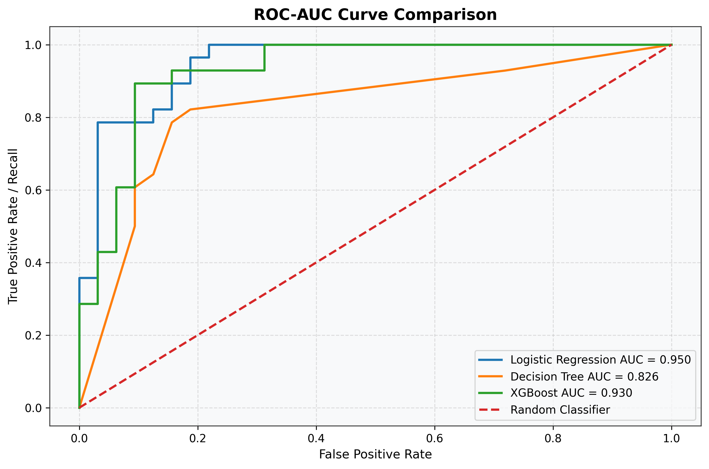

ROC-AUC was used to evaluate how well each model separates heart disease and no-heart-disease cases across different thresholds. A higher AUC score means better class separation.

---

## Author

**Usama Fiaz**  
AI Engineer | Machine Learning | NLP | Neural Networks | Supervised Learning | Unsupervised Learning | Deep Learning | Data Science

Email: usama20010101@gmail.com  
LinkedIn: https://www.linkedin.com/in/usama2001/